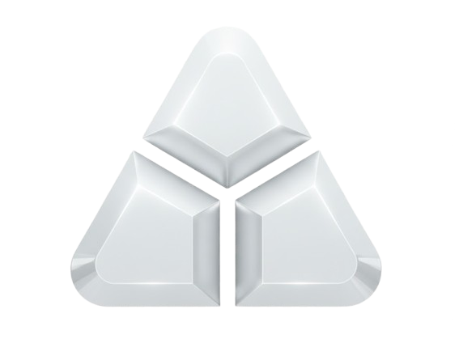
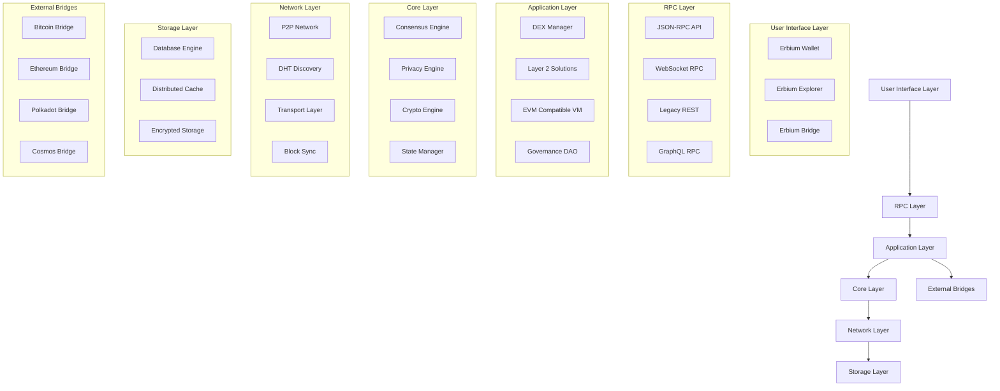

<<<<<<< Updated upstream
# rust-erbium
Erbium is a next-generation blockchain focused on security, scalability, and interoperability. The project implements advanced technologies such as post-quantum cryptography, zero-knowledge proofs, and cross-chain bridges.
=======
<div align="center">
  
</div>

<div align="center">
  <h1>Erbium Blockchain</h1>
  <p><strong>Next-Generation Post-Quantum Blockchain with Advanced Privacy & Interoperability</strong></p>
</div>

<div align="center">

[](https://github.com/iamsigint/rust-erbium/actions/workflows/ci-build.yml)
[](https://github.com/iamsigint/rust-erbium/actions/workflows/ci-security-scan.yml)
[](https://www.rust-lang.org/)
[]()


</div>

## 🏗️ Erbium Network Layers

<div align="center">

| 🌐 **Network Layer** | 📋 **Consensus Layer** | ⚙️ **VM Layer** | 🎨 **Application Layer** |
|----------------------|----------------------|----------------|--------------------------|
| **P2P Protocol**<br>P2P networking, DHT discovery, transport security | **PoS Consensus**<br>Validator selection, randomness, rewards system | **EVM Compatible**<br>Smart contracts, transaction execution, gas metering | **DeFi & Bridges**<br>DEX, Layer 2, cross-chain interoperability |
| Discovery & bootstrapping | Slashing & rewards | Dilithium signatures | Governance DAO |
| Firewall & rate limiting | 14-day unbonding | Zero-knowledge proofs | Tokenomics & staking |
| **🔗 Decentralized & Secure** | **⚡ 30s Block Time** | **🛡️ Post-Quantum** | **🌍 Interoperable** |

</div>

---

<div align="center">

**Erbium** is a revolutionary blockchain built for the quantum-resistant future, featuring post-quantum cryptography, zero-knowledge privacy, cross-chain interoperability, and enterprise-grade scalability. Designed to bridge traditional and decentralized finance through advanced Layer 2 solutions and DeFi protocols.

[🏁 Quick Start](#quick-start) • [📖 Documentation](#documentation) • [🔧 Installation](#installation) • [🚀 Features](#features) • [🎯 Architecture](#architecture)

</div>

---

## 🌟 Core Features

### 🔐 **Post-Quantum Security**
- **Dilithium Digital Signatures**: Quantum-resistant cryptographic primitives
- **Hardware Security Modules**: TPM/TEE integration for key management
- **Homomorphic Encryption**: Privacy-preserving computation on encrypted data
- **Hardware Wallet Support**: Secure key storage and transaction signing

### 🛡️ **Advanced Privacy & Compliance**
- **Zero-Knowledge Proofs**: Confidential transactions and selective disclosure
- **Range Proofs**: Privacy for transaction amounts
- **Stealth Addresses**: Enhanced privacy for recipient addresses
- **KYC/AML Integration**: Regulatory compliance frameworks
- **Automated Compliance Checking**: Real-time transaction monitoring

### 🌐 **Multi-Chain Interoperability**
- **Cross-Chain Bridges**: Seamless asset transfers between blockchains
- **Supported Chains**: Bitcoin, Ethereum, Polkadot, Cosmos, and more
- **Bridge Validators**: Decentralized validation of cross-chain operations
- **Asset Wrapping**: Native token representations on foreign chains

### ⚡ **High Performance & Scalability**
- **Layer 2 Solutions**: State channels, sidechains, and optimistic rollups
- **DEX Integration**: Decentralized exchange with order books and AMM
- **Parallel Processing**: Multi-core transaction validation
- **State Pruning**: Efficient historical data management
- **Distributed Caching**: High-performance data layer

### 🎨 **DeFi & Layer 2 Ecosystem**
- **DEX Protocol**: Complete decentralized exchange with limit/market orders
- **AMM Pools**: Automated market makers for liquidity provision
- **Yield Farming**: DeFi protocols for passive income generation
- **Governance DAO**: Decentralized governance and treasury management
- **Staking & Rewards**: Proof-of-Stake consensus mechanism

## 🏗️ Architecture




## 🚀 Quick Start

### System Requirements

#### Minimum Requirements
- **CPU**: 2 cores (4+ cores recommended)
- **RAM**: 4GB (8GB+ recommended)
- **Storage**: 50GB SSD (100GB+ SSD recommended)
- **Network**: 10Mbps stable internet
- **Operating System**: Linux (Ubuntu 20.04+), macOS 12+, Windows 10+

#### Recommended Specifications (Production Node)
- **CPU**: 8+ cores (Intel Xeon/AMD Ryzen)
- **RAM**: 16GB+ DDR4
- **Storage**: 500GB+ NVMe SSD
- **Network**: 100Mbps+ dedicated bandwidth
- **Operating System**: Ubuntu Server 22.04 LTS

### Prerequisites

- **Rust 1.70+**: [Install Rust](https://rustup.rs/)
- **OpenSSL**: Required for cryptographic operations
- **LLVM/Clang**: Required for some dependencies

### Installation

#### 1. Clone the Repository
```bash
git clone https://github.com/iamsigint/rust-erbium.git
cd rust-erbium
```

#### 2. Install Dependencies

**Linux/macOS:**
```bash
sudo ./scripts/install_dependencies.sh
```

**Windows:**
```powershell
powershell -ExecutionPolicy Bypass -File scripts/install_dependencies.ps1
```

#### 3. Build the Project
```bash
# Debug build (recommended for development)
cargo build

# Release build (optimized for production)
cargo build --release
```

#### 4. Run the Blockchain Node
```bash
# Start the main blockchain node
cargo run --bin erbium-node

# Or start with specific configuration
cargo run --bin erbium-node -- --network devnet
```

### 🧪 Basic Testing

```bash
# Run unit tests
cargo test

# Run benchmarks
cargo bench

# Run load testing
cargo run --bin load_tester
```

## 📖 Documentation

### 🏛️ **Architecture & Design**
- [**System Architecture**](docs/references/architecture.md) - Complete system overview
- [**Security Model**](docs/references/security.md) - Security architecture and threat models
- [**Performance**](docs/references/performance.md) - Performance benchmarks and optimization

### 🔧 **Core Components**
- [**Blockchain Core**](docs/references/core.md) - Core blockchain implementation
- [**Consensus Engine**](docs/references/consensus.md) - Proof-of-Stake consensus
- [**Virtual Machine**](docs/references/vm.md) - EVM-compatible smart contract execution
- [**DEX Protocol**](docs/references/dex.md) - Decentralized exchange implementation

### 🔐 **Cryptography & Privacy**
- [**Cryptographic Primitives**](docs/references/crypto.md) - Dialithium, signatures, hashing
- [**Privacy Solutions**](docs/references/privacy.md) - ZK-proofs, confidential transactions
- [**Zero-Knowledge Proofs**](docs/references/zk-proofs.md) - ZK implementations
- [**Key Management**](docs/references/key-management.md) - HSM and hardware security

### 🌐 **Networks & Interoperability**
- [**P2P Networking**](docs/references/networking.md) - Peer-to-peer protocols
- [**Cross-Chain Bridges**](docs/references/bridges.md) - Bridge architecture and operations
- [**Network Security**](docs/references/network-security.md) - Network-level security measures

### 📊 **Layer 2 & DeFi**
- [**Layer 2 Solutions**](docs/references/layer2.md) - State channels, sidechains
- [**Governance DAO**](docs/references/governance.md) - Decentralized governance
- [**Compliance Framework**](docs/references/compliance.md) - Regulatory compliance
- [**Analytics Engine**](docs/references/analytics.md) - Monitoring and analytics

### 🔌 **APIs & Integration**
- [**REST API**](docs/references/api-rest.md) - RESTful API documentation
- [**RPC API**](docs/references/api-rpc.md) - JSON-RPC interface
- [**GraphQL API**](docs/references/api-graphql.md) - GraphQL API schema
- [**WebSocket API**](docs/references/api-websocket.md) - Real-time streaming

### 🗄️ **Storage & Database**
- [**Database Layer**](docs/references/storage.md) - Storage architecture
- [**Encryption**](docs/references/storage-encryption.md) - Encrypted data storage
- [**Optimization**](docs/references/storage-optimization.md) - Performance tuning

### 🏭 **Operations & Deployment**
- [**Node Operation**](docs/references/node.md) - Node management and configuration
- [**Cloud Deployment**](docs/references/deployment.md) - Cloud deployment guides
- [**Monitoring**](docs/references/monitoring.md) - Observability and alerting
- [**Security Audit**](docs/references/audit.md) - Security audit procedures

### 📄 **Additional Resources**
- [**Whitepaper**](docs/whitepaper.pdf) - Technical whitepaper (PDF)
- [**API Testing Guide**](docs/references/api-testing.md) - API integration testing
- [**Contributing**](CONTRIBUTING.md) - Contribution guidelines
- [**Troubleshooting**](docs/references/troubleshooting.md) - Common issues and solutions

## 🔧 Configuration

Erbium supports multiple network configurations:

```toml
# config/devnet.toml - Development network
[blockchain]
chain_id = 1337
block_time = 30
max_block_size = 8388608

[node]
listen_address = "127.0.0.1"
p2p_port = 30303
rpc_port = 8545
rest_port = 8080

[consensus]
consensus_type = "pos"
min_stake = 1000000
```

Available configurations:
- **`devnet`** - Development and testing environment
- **`testnet`** - Public test network
- **`mainnet`** - Production main network

## 🚀 Advanced Usage

### Running Different Components

```bash
# Start only the blockchain node
cargo run --bin erbium-node -- --config config/mainnet.toml

# Start the wallet interface
cargo run --bin erbium-wallet

# Start the block explorer
cargo run --bin erbium-explorer

# Start cross-chain bridge
cargo run --bin erbium-bridge -- --chain ethereum --config config/mainnet.toml
```

### Multi-Node Setup

```bash
# Node 1 - Bootstrap node
cargo run --bin erbium-node -- --bootstrap-node

# Node 2 - Join the network
cargo run --bin erbium-node -- --bootstrap-peers "node1.example.com:30303"
```

### Monitoring and Metrics

```bash
# View node metrics
curl http://localhost:9090/metrics

# View REST API documentation
curl http://localhost:8080/docs

# Check node status
curl http://localhost:8080/status
```

## 🧪 Testing & Quality Assurance

### Test Coverage
```bash
# Run all tests with coverage
cargo test -- --nocapture

# Run specific test modules
cargo test core::  # Test core module
cargo test consensus::  # Test consensus module

# Integration tests
cargo test --test integration
```

### Benchmarking
```bash
# Run performance benchmarks
cargo bench

# Load testing
./scripts/benchmark_performance.sh

# TPS testing
cargo run --bin tps_benchmark
```

## 📊 Performance Metrics

| Metric | Value | Description |
|--------|--------|-------------|
| **Block Time** | 30 seconds | Target block production time |
| **TPS** | 1,000+ | Theoretical transactions per second |
| **Block Size** | 8MB | Maximum block size |
| **Finality** | Instant | Transaction finality time |
| **Latency** | <100ms | P2P message latency |

## 🔍 Security

Erbium implements multiple layers of security:

- **Code Audits**: Regular third-party security audits
- **Bug Bounty**: Active bug bounty program
- **Multi-sig Wallets**: Enhanced security for large transactions
- **Emergency Response**: 24/7 security monitoring and response
- **Penetration Testing**: Regular security assessments

See our [Security Documentation](docs/references/security.md) for detailed security information.

## 🤝 Contributing

We welcome contributions to Erbium! Please see our [Contributing Guide](CONTRIBUTING.md) for details.

### Development Workflow
1. Fork the repository
2. Create a feature branch
3. Make your changes with tests
4. Submit a pull request
5. Wait for code review

### Code Quality Standards
- All code must pass `cargo clippy`
- Test coverage > 85%
- No security vulnerabilities
- Follow Rust best practices

## 📞 Support & Community

- **GitHub Issues**: [Report bugs and request features](https://github.com/iamsigint/rust-erbium/issues)
- **Discussions**: [Community discussions](https://github.com/iamsigint/rust-erbium/discussions)
- **Discord**: [Join our Discord community](https://discord.gg/erbium)
- **Documentation**: [Full technical documentation](https://docs.erbium.io)

## 🙏 Acknowledgments

- **Rust Community**: For the amazing language and ecosystem
- **Ethereum Foundation**: For inspiring EVM compatibility
- **Academic Researchers**: For post-quantum cryptography advancements
- **Open Source Contributors**: For libraries and tools that power Erbium

---

<div align="center">

**Built with ❤️ using Rust | Quantum-Resistant | Privacy-First | Interoperable**

[🔝 Back to Top](#erbium-blockchain)

</div>
>>>>>>> Stashed changes
